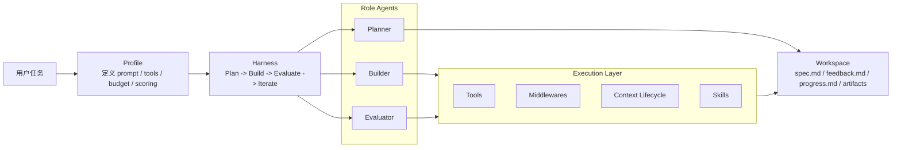

# Harness

一个基于 `Profile-Driven` 架构的多 Agent 自主执行框架。

它的目标不是把大模型包装成“会聊天的工具调用器”，而是围绕真实任务完成过程，构建一条可复用的执行闭环：

`规划 -> 执行 -> 验证 -> 迭代`

项目整体采用纯 Python 实现，使用 OpenAI-Compatible API，不依赖专用 Agent SDK。当前内置了面向 Web 应用生成、终端任务求解、代码修复与知识推理的多种任务场景。

## 项目定位

这个项目想解决的核心问题是：

- 单一 prompt 很难稳定覆盖不同类型任务
- 长任务容易因为上下文膨胀、重复试错或验证失真而失控
- 不同场景需要不同的 prompt、tool、预算与评估逻辑，但不应该重复造轮子

因此，Harness 把“通用执行引擎”和“场景化策略”拆开：

- `Harness` 负责主循环与生命周期管理
- `Profile` 负责不同任务场景下的角色配置与策略差异
- `Agent` 负责单角色的推理与工具执行
- `Tools / Middlewares / Context` 共同构成执行层

## 核心架构



这套结构的重点不在“多开几个 agent”，而在于把不同职责拆清楚：

- `Planner` 负责分析任务并生成计划
- `Builder` 负责实际执行、修改文件、运行命令、修复问题
- `Evaluator` 负责按场景定义验证结果并给出反馈
- `Harness` 负责把这些角色串成统一工作流，而不是把所有行为塞进一个超级 prompt

## 设计亮点

### 1. Profile-Driven 编排

项目的核心不是固定的 agent prompt，而是 `Profile`。

每个 profile 都可以独立定义：

- 不同角色的 system prompt
- 每个角色可用的工具集合
- 不同阶段的时间预算
- 评分方式与通过阈值
- 是否启用 contract negotiation
- 中间件策略与行为约束

这意味着同一套执行引擎，可以被复用到完全不同的任务场景，而不需要为每类任务重写一套框架。

当前内置的 profile 包括：

| Profile | 作用 |
| --- | --- |
| `app-builder` | 从一句自然语言描述出发生成完整 Web 应用 |
| `terminal` | 解决终端 / CLI 环境中的真实任务 |
| `swe-bench` | 面向真实仓库问题修复的代码补丁流程 |
| `reasoning` | 面向知识密集型问题的分析、求解与验证 |

### 2. 角色分层而不是单 Agent 混做

Harness 默认使用 `Planner / Builder / Evaluator` 分层协作：

- `Planner` 输出结构化计划到 `spec.md`
- `Builder` 根据 `spec.md` 落地执行
- `Evaluator` 基于结果写回 `feedback.md`
- `Harness` 根据评分和历史反馈决定是否继续下一轮

相比“一个 agent 从头做到底”，这种设计更适合长任务，因为：

- 规划、执行、验证的目标不同
- 不同阶段需要不同上下文
- 失败时可以基于反馈迭代，而不是整段重来

### 3. 有状态执行而不是一次性命令调用

在终端类任务里，项目引入了持久化 Shell 会话：

- 当前工作目录会保留
- 环境变量修改会保留
- 后台进程状态会保留
- 多条命令可以共享同一个运行上下文

这让 agent 不只是“调用一个 shell 命令”，而是可以真正像人在终端里连续工作。

### 4. Context Lifecycle 管理

长任务的核心挑战之一是上下文污染与 token 膨胀。项目在 agent 循环里内建了上下文治理能力：

- 超阈值时自动压缩上下文
- 出现“焦虑式重复”时触发 reset
- 通过 checkpoint 机制保留关键信息后恢复对话
- 按角色进行差异化保留，而不是简单裁剪历史消息

这使系统更适合执行长链路任务，而不是只适合一次性短问答。

### 5. Middleware 作为行为控制面

除了 prompt，本项目大量行为约束是通过 middleware 完成的。

当前中间件主要负责：

- 循环检测
- 时间预算提醒
- 退出前强制验证
- 任务进度跟踪
- 失败恢复模式切换
- 错误引导

这种设计让“agent 应该怎么做”不只依赖语言提示，而是变成可复用、可组合、可限制的执行策略。

### 6. Tool 层和 Skill 层分离

项目把“怎么想”和“怎么做”拆成两层：

- `Tool` 负责具体动作，例如读写文件、执行 shell、浏览器测试、子 agent 委派
- `Skill` 负责方法论与领域流程，例如让 agent 在需要时再主动读取技能文档

这种分层比把所有经验都塞进 system prompt 更可扩展，也更适合持续迭代。

### 7. 可追踪的执行过程

每个 agent 会将关键事件写入 `_trace_<agent>.jsonl`：

- 每轮迭代
- LLM 输出
- 工具调用
- middleware 注入
- 上下文压缩 / reset
- 错误与结束原因

这让系统不再是黑盒式运行，更适合调试和分析长任务行为。

## 典型工作流

在一次完整执行中，工作区通常会出现这些关键文件：

- `spec.md`：规划结果或任务规格
- `contract.md`：阶段性执行契约
- `feedback.md`：评估反馈
- `progress.md`：任务板与当前进度

这几个文件共同构成 agent 的外部工作记忆，使流程不只存在于上下文里，也落到了可检查的工作区中。

## 快速开始

### 1. 安装依赖

```bash
pip install -r requirements.txt
```

如果你要使用 `app-builder` 的浏览器验证能力，还需要安装 Playwright 浏览器：

```bash
playwright install chromium
```

### 2. 配置模型

复制环境变量模板：

```bash
cp .env.template .env
```

至少需要配置：

```env
OPENAI_API_KEY=your_api_key
OPENAI_BASE_URL=https://api.openai.com/v1
HARNESS_MODEL=gpt-4o
```

项目使用 OpenAI-Compatible API，因此可以切换到任何兼容该接口的模型服务。

### 3. 查看可用 Profile

```bash
python harness.py --list-profiles
```

### 4. 运行示例

默认使用 `app-builder`：

```bash
python harness.py "Build a DAW in the browser"
```

切换到终端任务：

```bash
python harness.py --profile terminal "Fix the broken symlinks in /tmp"
```

切换到代码修复任务：

```bash
python harness.py --profile swe-bench "Fix the TypeError in parse_config()"
```

切换到推理任务：

```bash
python harness.py --profile reasoning "What is the escape velocity of Mars?"
```

## 项目结构

```text
.
├── harness.py           # 主编排循环：Plan -> Build -> Evaluate -> Iterate
├── agents.py            # 单角色 Agent 运行时与 trace 记录
├── tools.py             # 文件、shell、浏览器、委派等工具实现
├── middlewares.py       # 循环检测、预算控制、验证、恢复等行为控制
├── context.py           # 上下文压缩、checkpoint、恢复逻辑
├── shell_session.py     # 持久化 shell 会话
├── skills.py            # 技能注册与 catalog 注入
├── profiles/            # 场景化策略定义
├── prompts.py           # 通用 prompt 模板
├── tests/               # 核心流程与工具测试
└── docs/                # 设计文档与实现计划
```

## 这个项目适合什么

如果你对下面这些问题感兴趣，这个项目会比较有参考价值：

- 如何把 Agent 从“对话系统”做成“任务执行系统”
- 如何让同一套框架适配多种任务场景
- 如何在长任务中管理上下文、状态与验证闭环
- 如何把 prompt、tool、middleware、profile 组织成可扩展架构

## 说明

这个项目受 Anthropic 关于长时任务 Harness 设计思路启发，但实现方式采用纯 Python + OpenAI-Compatible API，重点放在：

- 可替换模型提供方
- 清晰的模块边界
- 可扩展的 profile 机制
- 更适合真实任务执行的工程化结构

感谢https://github.com/lazyFrogLOL/Harness_Engineering提供的思路
